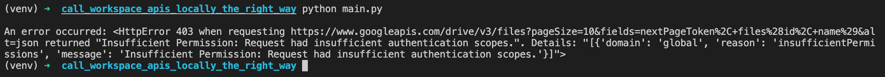
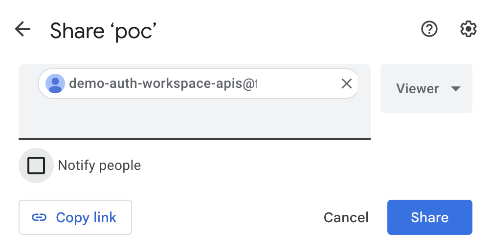

# Call Workspace APIs locally (the right way)

This LAB is an implementation of principles describe in this [blog post](https://medium.com/@loic.sikidi/authenticating-to-workspace-apis-locally-the-right-way-e2a6f283c0ba). 

## What the content of the LAB?

A simple python script that list the content (just filenames) of your Google Drive.

**Note: don't trust me blindly, please read to `main.py` and `requirements.txt` by yourself!**

This LAB aims to describe issues when interacting with a Workspace API using your user-credentials and how you can fix it. 

Prerequisites:
  * python
  * gcloud

## LAB

### Setup

```bash
PROJECT=YOUR_PROJECT_ID

gcloud config set project $PROJECT

gcloud services enable drive.googleapis.com

gcloud iam service-accounts create demo-auth-workspace-apis

python3 -m venv venv && venv/bin/activate

pip install -r requirements.txt
```

### **1. Test with user-credentials**

```bash
gcloud auth application-default login

python main.py
```

You shloud see the following error:



### **2. Test with a service account impersonation**

A way to fix this issue it so interact with Workspace API using a service account identity.

In order to work you will have to:

1. Give `demo-auth-workspace-apis@${PROJECT}.iam.gserviceaccount.com` a viewer access to your Google Drive



2. Run commands below:

```bash
export SA_TO_IMPERSONATE="demo-auth-workspace-apis@${PROJECT}.iam.gserviceaccount.com"

# Role allowing to impersonnate the targeted SA
gcloud iam service-accounts add-iam-policy-binding "${SA_TO_IMPERSONATE}" \
--member="user:$(gcloud auth list --filter=status=active --format='value(account)')" \
--role='roles/iam.serviceAccountTokenCreator'

python main.py
```

Now, normally the script should work 🚀!

*Note: if not please create an [issue](https://github.com/LoicSikidi/call_workspace_apis_locally_the_right_way/issues)*

### Cleanup

```bash
gcloud iam service-accounts delete "demo-auth-workspace-apis@${PROJECT}.iam.gserviceaccount.com" -q
gcloud services disable drive.googleapis.com
```
